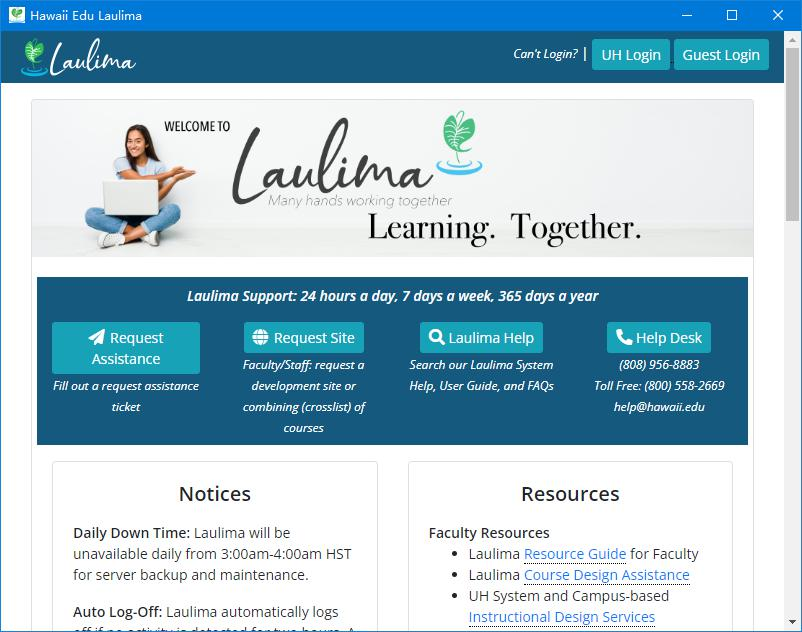
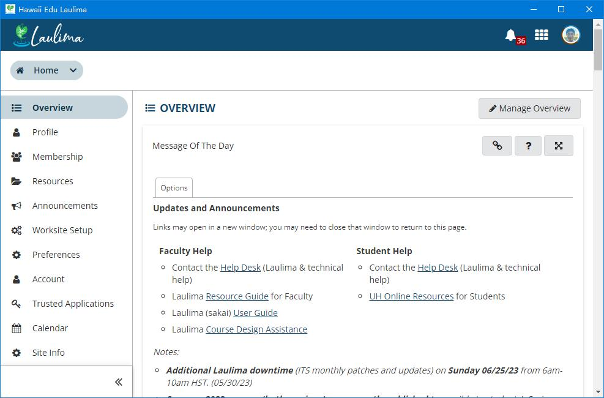

# tauri-hawaii-edu-laulima
使用rust语言的tarui框架将hawaii edu laulima 网页版 封装为的hawaii edu laulima 桌面版应用
The tarui framework of rust language is used to encapsulate the hawaii edu laulima web application as the hawaii edu laulima desktop application.
laulima is a teaching system at the University of Hawaii.I'm one of the students who uses it

